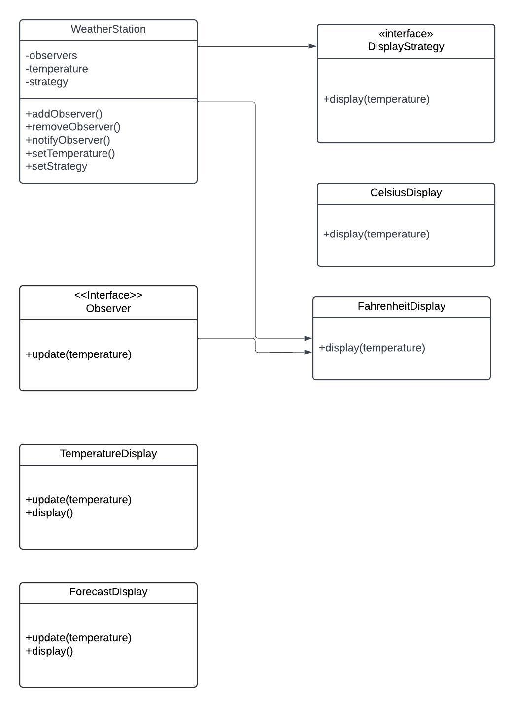

## Weather Station Project

This project is a **Weather Station System** that displays temperature in multiple formats and updates display units in real-time as temperature changes. It is implemented in Python and uses two primary design patterns: **DisplayStrategy** and **Observer**.

### Design Patterns Used

- **DisplayStrategy Pattern**: This pattern provides flexibility in displaying temperature in different formats. The `WeatherStation` class holds a reference to an instance of `DisplayStrategy`, allowing it to use any concrete display strategy without direct dependency.
  - **DisplayStrategy Interface**: Defines a `display(temperature: float)` method that all display strategies (e.g., `CelsiusDisplay`, `FahrenheitDisplay`) must implement. This allows `WeatherStation` to switch display formats by using any class implementing the `DisplayStrategy` interface.
  - **Concrete Strategies**:
    - **CelsiusDisplay**: Displays temperature in Celsius.
    - **FahrenheitDisplay**: Displays temperature in Fahrenheit.

- **Observer Pattern**: This pattern enables real-time updates to display units. Display units, such as temperature and forecast displays, act as observers that receive updates whenever the temperature changes.
  - **Observer Interface**: Defines an `update(temperature: float)` method for receiving notifications. This interface allows multiple display units to function as observers, each responding to temperature changes as needed.
  - **Concrete Observers**:
    - **TemperatureDisplay**: Displays the current temperature.
    - **ForecastDisplay**: Displays forecast information, potentially based on temperature trends.

### Requirements

1. **Flexible Temperature Display Options**: The system supports multiple temperature display formats (e.g., Celsius, Fahrenheit) and allows for easy addition of new formats without modifying core logic.

2. **Real-time Temperature Updates**: All registered display units should receive updates immediately when the temperature changes to display the latest information.

3. **Modular and Extensible Design**: The design enables easy addition of new display formats and observer types without modifying the core `WeatherStation` logic, ensuring scalability and adaptability for future needs.

### Requirement Diagram

Below is the requirement diagram for the Weather Station project, illustrating how the system requirements map to design patterns and interfaces:

This diagram shows:
- The three key requirements for the system (flexible display options, real-time updates, and modular design).
- How each design pattern fulfills specific requirements.
- Connections to the interfaces and classes that implement these patterns.

### Class Diagram

Here is the class diagram for the Weather Station project, illustrating the relationships between the `WeatherStation` class, `DisplayStrategy` interface, `Observer` interface, and their implementations.

### Class Descriptions

- **WeatherStation Class**:
  - Holds a reference to a `DisplayStrategy` instance, enabling it to interact with any display format through the `DisplayStrategy` interface.
  - Maintains a list of observers, each implementing the `Observer` interface, and notifies them of any temperature changes.
  - Calls the `display()` method on the current strategy and the `update()` method on each observer, allowing for flexibility and real-time updates.

- **DisplayStrategy Interface**:
  - Defines the `display(temperature: float)` method, which concrete strategies like `CelsiusDisplay` and `FahrenheitDisplay` implement to provide specific temperature formats.

- **Observer Interface**:
  - Defines the `update(temperature: float)` method, allowing display units to receive real-time updates from `WeatherStation`.

### How It Works

1. The `WeatherStation` class maintains a reference to the current `DisplayStrategy` and a list of observers.
2. When the temperature changes, `WeatherStation`:
   - Calls the `display()` method on the current display strategy to show the temperature in the selected format.
   - Notifies all observers by calling their `update()` method, ensuring that each display unit reflects the latest temperature.

